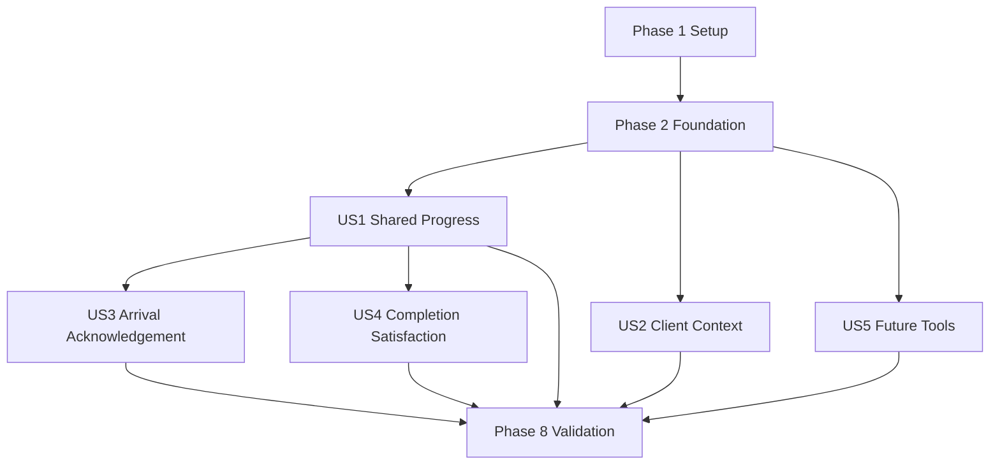

# Tasks: Packing List Status Progress

**Input**: Design documents from `/specs/005-packing-list-status/`

**Prerequisites**: `plan.md`, `spec.md`, `research.md`, `data-model.md`, `contracts/packing-list-progress-api.yaml`, `quickstart.md`

**Tests**: The feature specifies API-contract and manual cross-surface validation rather than TDD, so validation tasks are included in the final phase instead of adding automated test tasks.

**Organization**: Tasks are grouped by user story so each increment can be implemented and validated independently after the shared foundation is complete.

## Format: `[ID] [P?] [Story] Description`

- **[P]**: Can run in parallel because it touches different files and has no dependency on another incomplete task
- **[Story]**: Maps the task to a user story in `spec.md`
- Every task names the exact file or files it changes or validates

## Phase 1: Setup (Shared Infrastructure)

**Purpose**: Add the approved icon dependencies used by the web and mobile progress experiences.

- [X] T001 [P] Add `lucide-react` to web dependencies in frontend/package.json and frontend/package-lock.json
- [X] T002 [P] Add `@expo/vector-icons` to mobile dependencies in mobile/package.json and mobile/package-lock.json

---

## Phase 2: Foundational (Blocking Prerequisites)

**Purpose**: Establish shared server persistence and the durable mobile queue required by every progress workflow.

**Critical**: Complete this phase before starting any user story.

- [X] T003 Add `progressStatus`, `PackingProgressTransition`, and versioned `PackingSatisfactionResponse` fields, relations, constraints, and indexes in backend/prisma/schema.prisma
- [X] T004 Create the idempotent CLOSED/legacy-COMPLETE progress backfill in backend/scripts/backfill-packing-progress.js
- [X] T005 [P] Add forward-only `progress_status`, `pending_progress_status`, and `packing_progress_transitions` SQLite migrations in mobile/src/db/schema.ts
- [X] T006 Implement typed progress state, transition queue CRUD, one-pending-transition enforcement, and reconciliation queries in mobile/src/db/queries.ts
- [X] T007 [P] Define language-neutral progress, transition, service-context, satisfaction, and completion request/response types in mobile/src/services/api.ts
- [X] T008 Implement durable transition flushing before normal edits, reconnect/foreground retry, and confirmed-state reconciliation in mobile/src/services/cacheService.ts and mobile/src/hooks/useLiveSync.ts

**Checkpoint**: Prisma can persist auditable transitions and survey responses, and mobile can durably queue and reconcile one transition per packing list.

---

## Phase 3: User Story 1 - Track and Advance Job Progress (Priority: P1) (MVP)

**Goal**: Show one shared four-stage progress value and allow the operator to advance sequentially from Not Started to Traveling with idempotent server confirmation.

**Independent Test**: Create a packing list, confirm Not Started on mobile and web, submit Start Travel twice with the same key, and verify exactly one Traveling transition plus web refresh within 10 seconds.

- [X] T009 [US1] Default new lists to NOT_STARTED, normalize closed lists to COMPLETED, serialize latest transition/history, and enforce existing packing authorization in backend/routes/packingLists.js
- [X] T010 [US1] Implement idempotent sequential `POST /:id/progress-transitions` validation, lock checking, transactional history creation, and conflict responses in backend/routes/packingLists.js
- [X] T011 [P] [US1] Add Spanish progress metadata, icons, completed/current/upcoming states, and accessible text labels in mobile/src/components/PackingProgressIndicator.tsx
- [X] T012 [US1] Cache server progress, render the four-stage indicator and pending state, and implement the confirmed Iniciar viaje action in mobile/src/screens/PackingListScreen.tsx
- [X] T013 [P] [US1] Add bilingual web progress metadata and icon mapping in frontend/src/constants.js and frontend/src/i18n.jsx
- [X] T014 [US1] Render progress/latest-transition details and add quiet 10-second visible-tab plus focus refresh behavior in frontend/src/pages/Files/PackingListsPanel.jsx

**Checkpoint**: The Not Started to Traveling slice is independently usable, idempotent, and visible on mobile and web.

---

## Phase 4: User Story 2 - Contact and Navigate to the Client (Priority: P1)

**Goal**: Present normalized client service context offline and launch phone or navigation handlers when valid data exists.

**Independent Test**: Open lists with complete and missing client data; verify normalized name, phone, address, and job type, then verify Call/Navigate handlers and disabled explanations.

- [X] T015 [US2] Resolve individual/corporate client name, client phone, origin/service address, and job type into `serviceContext` list/detail responses in backend/routes/packingLists.js
- [X] T016 [P] [US2] Extend cached moving-file references with normalized service-context fields during create and reconciliation in mobile/src/screens/NewPackingListScreen.tsx and mobile/src/services/cacheService.ts
- [X] T017 [US2] Render Spanish client context and localized job type, validate missing values, and launch `tel:` and encoded navigation links in mobile/src/screens/PackingListScreen.tsx

**Checkpoint**: Client details and device actions work independently of later acknowledgement and completion flows, including from cached data.

---

## Phase 5: User Story 3 - Capture Arrival Acknowledgement (Priority: P1)

**Goal**: Require a bilingual client-facing arrival signature, retain optional operator observations, and advance Traveling to Working online or through durable retry.

**Independent Test**: From Traveling, verify missing signature is rejected, complete arrival in both EN and ES, inspect acknowledgement on mobile/web, and repeat offline through restart and reconnect.

- [X] T018 [US3] Require an Azure arrival signature for WORKING transitions, retain observations/blob path, and return expiring signature URLs in backend/routes/packingLists.js
- [X] T019 [P] [US3] Add the ArrivalAcknowledgement route parameters and screen registration in mobile/src/navigation/types.ts and mobile/App.tsx
- [X] T020 [US3] Build EN/ES language selection, fully translated acknowledgement/observations/signature content, validation, and pending-submit behavior in mobile/src/screens/ArrivalAcknowledgementScreen.tsx
- [X] T021 [US3] Connect Ya llegamos to arrival navigation and reconcile pending WORKING state and acknowledgement history in mobile/src/screens/PackingListScreen.tsx
- [X] T022 [US3] Upload queued arrival signatures to Azure before transition submission while retaining local signature data until confirmation in mobile/src/services/cacheService.ts
- [X] T023 [P] [US3] Add bilingual arrival acknowledgement labels and authorized signature/history detail rendering in frontend/src/i18n.jsx and frontend/src/pages/Files/PackingListsPanel.jsx

**Checkpoint**: Traveling to Working requires a complete bilingual acknowledgement, remains recoverable offline, and is auditable on both clients.

---

## Phase 6: User Story 4 - Complete Work and Record Satisfaction (Priority: P1)

**Goal**: Extend final sign-off with bilingual observations and a required versioned one-to-five-star response, then atomically close lifecycle and progress.

**Independent Test**: Complete a Working list in EN and ES, reject missing/out-of-range ratings, verify Closed plus Completed and retained sign-off details, then repeat with interrupted connectivity.

- [X] T024 [US4] Extend `PATCH /:id/complete` with idempotency, WORKING-only validation, version-1 rating validation, and an atomic transition/survey/sign-off/lifecycle transaction in backend/routes/packingLists.js
- [X] T025 [P] [US4] Build an accessible controlled one-to-five-star selector with required-state feedback in mobile/src/components/StarRating.tsx
- [X] T026 [US4] Extend EN/ES completion review with consistently translated observations, signature, decline, and satisfaction content in mobile/src/screens/SignatureScreen.tsx
- [X] T027 [US4] Persist completion idempotency, observations, survey payload, and pending COMPLETED state for restart-safe retry in mobile/src/db/queries.ts and mobile/src/services/cacheService.ts
- [X] T028 [US4] Display confirmed completion observations, signature outcome, survey version, and rating while preventing normal edits after Completed in mobile/src/screens/PackingListScreen.tsx
- [X] T029 [P] [US4] Add EN/ES completion and satisfaction strings and authorized sign-off detail rendering in frontend/src/i18n.jsx and frontend/src/pages/Files/PackingListsPanel.jsx

**Checkpoint**: Working to Completed is atomic, bilingual for the client, retry-safe, versioned, and read-only after confirmation.

---

## Phase 7: User Story 5 - Access Future Job Tools (Priority: P3)

**Goal**: Provide a Spanish Options menu containing non-mutating Incident, Documents, and Materials placeholders.

**Independent Test**: Select every option and verify its distinct icon, Spanish coming-soon message, and zero navigation or operational data mutation.

- [X] T030 [US5] Add a stable Options menu with distinct Incident, Documents, and Materials icons, Spanish labels, and non-mutating coming-soon feedback in mobile/src/screens/PackingListScreen.tsx

**Checkpoint**: All three future tools are discoverable without exposing unfinished workflows.

---

## Phase 8: Polish & Cross-Cutting Concerns

**Purpose**: Validate schema rollout, static quality gates, authorization, language boundaries, and end-to-end behavior.

- [X] T031 Run `npx prisma db push`, `npx prisma generate`, and `node scripts/backfill-packing-progress.js` from backend/ and verify the idempotent migration rules in specs/005-packing-list-status/data-model.md
- [X] T032 [P] Run the production build from frontend/package.json and resolve feature-related build errors in frontend/src/constants.js, frontend/src/i18n.jsx, and frontend/src/pages/Files/PackingListsPanel.jsx
- [X] T033 [P] Run `npx tsc --noEmit` from mobile/package.json and resolve feature-related type errors under mobile/src/
- [X] T034 Validate BODEGA authorization, append-only history, soft-delete retention, Azure-only signatures, and language-neutral API enums against backend/routes/packingLists.js and specs/005-packing-list-status/contracts/packing-list-progress-api.yaml
- [ ] T035 Validate operator-facing Spanish, complete client-facing EN/ES selection on both arrival and completion screens, web EN/ES parity, offline retries, polling, and all scenarios in specs/005-packing-list-status/quickstart.md

---

## Dependencies & Execution Order

### Phase Dependencies

- **Setup (Phase 1)**: No dependencies; T001 and T002 can run in parallel.
- **Foundational (Phase 2)**: Depends on Setup. T003 precedes T004; T005 precedes T006; T007 can run alongside the schema work; T006 and T007 precede T008.
- **US1 (Phase 3)**: Depends on Foundation and establishes the progress contract and shared display used by US3 and US4.
- **US2 (Phase 4)**: Depends on Foundation; it can run alongside US1 except where both edit `backend/routes/packingLists.js` or `mobile/src/screens/PackingListScreen.tsx`.
- **US3 (Phase 5)**: Depends on US1's sequential transition endpoint and progress UI.
- **US4 (Phase 6)**: Depends on US1's progress model and Foundation's satisfaction persistence; it does not require US3 implementation to be coded, but acceptance progression requires a list at Working.
- **US5 (Phase 7)**: Depends only on Foundation and can be implemented independently, coordinating edits to `PackingListScreen.tsx`.
- **Polish (Phase 8)**: Depends on all stories selected for delivery.

### User Story Completion Order

### Within Each User Story

- Implement persistence and server contract behavior before client submission flows.
- Build standalone components before integrating them into screens.
- Preserve existing lifecycle, lock, full-state save, and completion retry behavior throughout.
- Validate each checkpoint before beginning work that depends on it.

## Parallel Execution Examples

### User Story 1

- In parallel after T010: T011 builds the mobile indicator while T013 adds web metadata and translations.
- After those complete: T012 integrates mobile progress while T014 integrates web progress and polling.

### User Story 2

- After T015 defines the DTO: T016 extends offline caching while a separate developer prepares T017 against the agreed `serviceContext` shape.

### User Story 3

- In parallel after T018: T019 registers navigation and T023 prepares web translations/detail rendering.
- After T019: T020 builds arrival capture; then T021 and T022 connect navigation and durable Azure submission.

### User Story 4

- In parallel after T024: T025 builds the star selector and T029 adds web translations/detail rendering.
- After T025: T026 integrates client sign-off; T027 then completes durable submission and T028 renders confirmed state.

### User Story 5

- T030 is a self-contained mobile presentation task and can run alongside US1-US4 when edits to `PackingListScreen.tsx` are coordinated.

## Implementation Strategy

### MVP First

1. Complete Setup and Foundation.
2. Complete US1 through the Not Started to Traveling checkpoint.
3. Run T031-T033 for the touched slices and validate US1 independently.
4. Demonstrate shared idempotent progress before adding acknowledgement detail.

### Incremental Delivery

1. Deliver US1 shared progress and polling.
2. Add US2 client context and device actions.
3. Add US3 bilingual arrival acknowledgement and offline retry.
4. Add US4 bilingual completion satisfaction and atomic close.
5. Add US5 placeholders.
6. Complete all cross-cutting validation in Phase 8.

### Parallel Team Strategy

1. Complete shared setup and foundation together.
2. Assign US1 progress, US2 service context, and US5 placeholders to separate owners with explicit coordination on shared route and screen files.
3. Start US3 and US4 after the US1 progress contract stabilizes; their standalone screens/components and web detail work can proceed in parallel.
4. Converge on the Phase 8 schema, build, authorization, language, and quickstart gates.

## Notes

- `[P]` marks work that is independent at that point in the dependency graph, not merely work in a different phase.
- Client-facing arrival and completion interactions must expose EN/ES selection and translate the entire interaction; operator progress and placeholder UI remains Spanish.
- Backend payloads and persisted domain values use `NOT_STARTED`, `TRAVELING`, `WORKING`, and `COMPLETED`, never localized labels.
- Do not replace lifecycle `status`, weaken device locks, bypass BODEGA authorization, or store signature binaries outside Azure Blob Storage.