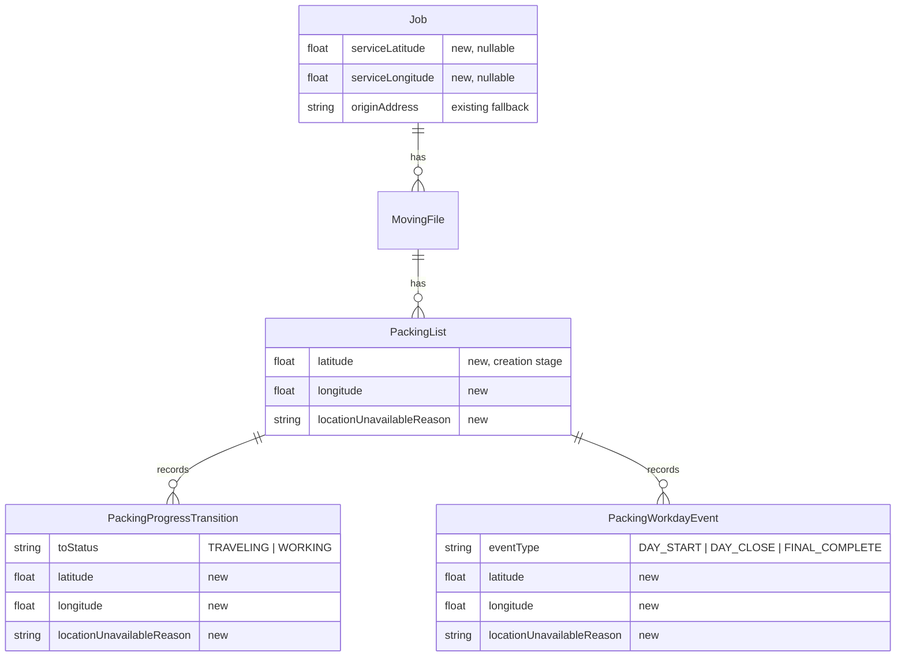

# Phase 1 Data Model: Packing List GPS Location Tracking

**Feature**: 007-packing-list-gps-location
**Date**: 2026-08-25
**Source**: [spec.md](./spec.md) · [research.md](./research.md)

---

## Overview

The feature is additive. No existing column is renamed, retyped, or removed. Every new column is nullable so existing rows remain valid without backfill.

Two independent data concerns:

1. **Stage location** — where the device was when a packing list lifecycle event occurred (immutable evidence).
2. **Job service coordinates** — the exact point a job should be performed at (mutable configuration).

---

## Shared value shape: Stage Location

Applied inline to each host row rather than as a separate table (see research R4).

| Field | Type | Null | Notes |
|---|---|---|---|
| `latitude` | Float | yes | WGS84 decimal degrees, −90..90 |
| `longitude` | Float | yes | WGS84 decimal degrees, −180..180 |
| `locationAccuracy` | Float | yes | Reported radius in meters |
| `locationCapturedAt` | DateTime | yes | Moment the position was measured on device |
| `locationUnavailableReason` | String | yes | Language-neutral enum, see below |

**Invariants**

- Either the position is present (`latitude` AND `longitude` non-null) or `locationUnavailableReason` is non-null. Both null is only valid for rows created before this feature.
- `latitude` and `longitude` are always written together; one without the other is invalid.
- Once an event is confirmed, these fields are immutable (FR-011, FR-022). Idempotent replays must not overwrite them.
- `locationCapturedAt` is device time at capture and may differ from `occurredAt`; it is not used for ordering.

**`locationUnavailableReason` enum** (language-neutral, FR-008)

| Value | Meaning |
|---|---|
| `PERMISSION_DENIED` | User denied or has not granted location permission |
| `SERVICES_DISABLED` | Device location services are off |
| `TIMEOUT` | No fix obtained within the capture budget |
| `UNSUPPORTED` | Device or platform exposes no location capability |
| `ERROR` | Any other failure |

---

## Backend entity changes (PostgreSQL / Prisma)

### 1. `PackingList` — creation stage (FR-001)

Add the Stage Location fields. The creation position pairs with the existing `createdAt`.

```
latitude                  Float?
longitude                 Float?
locationAccuracy          Float?
locationCapturedAt        DateTime?
locationUnavailableReason String?
```

Written once by `POST /api/packing-lists`. Never updated afterwards.

### 2. `PackingProgressTransition` — travel start and work start (FR-002, FR-003)

Add the same five fields. Written once by `POST /api/packing-lists/:id/progress-transitions` on initial create only; the existing idempotency short-circuit path returns the stored event unchanged.

Covers `toStatus = TRAVELING` (travel start) and `toStatus = WORKING` (work start).

### 3. `PackingWorkdayEvent` — day start, day close, final completion (FR-004, FR-005)

Add the same five fields. Written once by `POST /api/packing-lists/:id/workday-events` for `DAY_START` / `DAY_CLOSE`, and by `PATCH /api/packing-lists/:id/complete` for the `FINAL_COMPLETE` event it already creates.

### 4. `Job` — service coordinates (FR-015 to FR-019)

```
serviceLatitude   Float?
serviceLongitude  Float?
```

**Invariants**

- Both present or both null. A single value is rejected.
- Ranges: latitude −90..90, longitude −180..180.
- Independent of `originAddress` / `originCity` / `originCountry`, which remain unchanged and remain the fallback (FR-020).
- Mutable. Editing them never rewrites historical stage locations (FR-022).
- Presence of both values is what marks a job as having exact coordinates (FR-018).

**Derived, not stored**: `hasExactCoordinates = serviceLatitude != null && serviceLongitude != null`.

---

## Mobile local store (SQLite)

Mirrors the backend fields so positions survive offline queueing (FR-010) and retries (FR-011). Added via the existing forward-only `addColumnIfMissing` migration pattern in `mobile/src/db/schema.ts`.

### `packing_lists`

```
latitude                    REAL
longitude                   REAL
location_accuracy           REAL
location_captured_at        TEXT
location_unavailable_reason TEXT
```

### `packing_progress_transitions`

Same five columns.

### `packing_workday_events`

Same five columns.

Values are written at enqueue time, sent verbatim on sync, and are not recomputed on retry.

### Cached service context

`packing_lists.moving_file_ref` is an existing JSON string. It gains two optional keys, so no schema change is required:

```
serviceLatitude?: number | null
serviceLongitude?: number | null
```

---

## API payload shape

A single reusable object is used on the wire for stage locations:

```
location: {
  latitude: number | null,
  longitude: number | null,
  accuracy: number | null,
  capturedAt: string | null,      // ISO 8601
  unavailableReason: string | null // enum above
} | null
```

- **Requests**: optional. Omitting it or sending `null` is valid and means no location information was supplied.
- **Responses**: always present on serialized lifecycle events, `null` only for pre-feature rows.

See [contracts/packing-list-location-api.yaml](./contracts/packing-list-location-api.yaml).

---

## Relationships



---

## Stage → storage mapping

| Lifecycle stage (spec) | Stored on | Discriminator |
|---|---|---|
| List created (FR-001) | `PackingList` | row itself |
| Travel to client starts (FR-002) | `PackingProgressTransition` | `toStatus = TRAVELING` |
| Work starts at client (FR-003) | `PackingProgressTransition` | `toStatus = WORKING` |
| Workday start (FR-004) | `PackingWorkdayEvent` | `eventType = DAY_START` |
| Workday close (FR-004) | `PackingWorkdayEvent` | `eventType = DAY_CLOSE` |
| Final completion (FR-005) | `PackingWorkdayEvent` | `eventType = FINAL_COMPLETE` |

---

## Migration notes

- Additive only; all new columns nullable with no default. No backfill required.
- Apply with `npx prisma db push` then `npx prisma generate` from `backend/` (constitution quality gate).
- Mobile migrations use `addColumnIfMissing`, which tolerates repeated execution on already-migrated devices.
- Pre-existing lifecycle events keep all location fields null and render as "no location captured" (FR-014).
